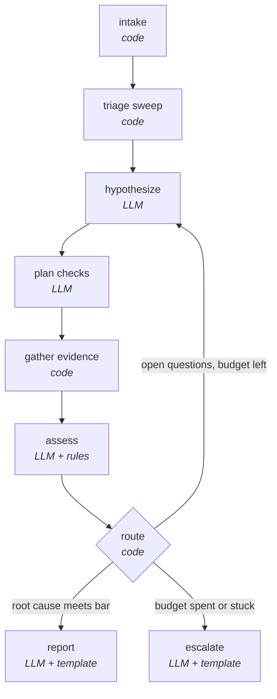

# Investigation agent: design

Design for the Chapter 3 agent, settled before any code is written. The state
schema, tool contract and stopping rules here are what Chapters 4 to 7 build on,
so changes to them should be deliberate.

## What the agent does, and doesn't

Given an alert, the agent investigates and produces a root-cause report with a
causal chain, the evidence behind every claim, and what it ruled out. It never
changes anything. It may *propose* actions (such as a rollback), but the tools
it can call are read-only by construction; acting is Chapter 5's problem.

Design goals, in priority order:

1. **Every conclusion is traceable.** Each claim in the report cites evidence,
   and each piece of evidence records the exact query that produced it.
2. **It finds root causes, not symptoms.** The case study's trap is stopping at
   the payment service, which is slow but not broken. The design has to make
   that mistake structurally hard, not just discouraged in a prompt.
3. **It knows when to stop and say "I don't know".** Bounded budget, explicit
   escalation, and a best-current-picture report when it escalates.
4. **It's testable.** The same incident should produce a comparable
   investigation run to run, so Chapter 6 can score it.
5. **It's observable.** Each step is a traced node with a small, inspectable
   state, so Chapter 7 can see what it did and what it cost.

## The graph



The split between code and LLM nodes is deliberate. Everything that can be
deterministic is, so runs are comparable and cheap. The model is used where
judgement is needed: generating hypotheses, choosing discriminating checks, and
interpreting evidence.

| Node | Kind | Responsibility |
|---|---|---|
| `intake` | code | Parse the alert, set the investigation window (alert start minus 30 minutes to now), initialise the budget |
| `triage` | code | Fixed first sweep, identical every run: RED metrics for the alerted service and its direct dependencies, error traces, Kubernetes events, and **all changes in the window**, widened once if none are found |
| `hypothesize` | LLM | Propose up to 3 new hypotheses, each with a kind, a parent in the why-chain, and predictions |
| `plan` | LLM | Choose up to 3 checks that best *discriminate* between open hypotheses |
| `gather` | code | Execute planned tool calls, record each result as evidence |
| `assess` | LLM + rules | Mark each new evidence item as supporting or refuting hypotheses; propose confidence updates, which rules then clamp |
| `route` | code | Conclude, escalate, or loop, using the criteria below |
| `report` / `escalate` | LLM + template | Write the output from structured state |

### Why the triage sweep always includes changes

In the first version of the case study the agent sees payment latency first,
hypothesises "payment is slow", finds supporting evidence, and stops. That's the
failure Chapter 3 opens with. Two design decisions fix it:

1. The triage sweep always calls `list_changes`, so the Helm release is in the
   evidence before the model forms its first hypothesis.
2. The why-chain rule (below) means "payment is slow" can never be the answer,
   because it's a mechanism with an unexplained cause.

## State

LangGraph state is structured data only. There is no running chat transcript:
each LLM node builds its own prompt from a compact rendering of the state. That
keeps prompts small (Chapter 2's context budget), makes every step inspectable,
and means the state *is* the investigation record Chapter 6 scores.

```python
from typing import Annotated, Literal, Optional
from typing_extensions import TypedDict
from pydantic import BaseModel
import operator

SignalType = Literal["metric", "trace", "log", "change", "k8s", "topology"]
HypothesisKind = Literal["symptom", "mechanism", "root_cause"]
HypothesisStatus = Literal["open", "supported", "refuted"]


class IncidentContext(BaseModel):
    alert_id: str
    service: str                  # service the alert fired on
    symptom: str                  # e.g. "checkout error rate above SLO"
    alert_started_at: str         # ISO 8601
    window_start: str
    window_end: str


class Evidence(BaseModel):
    id: str                       # "E7"
    tool: str
    args: dict                    # exact arguments: the query provenance
    signal: SignalType
    summary: str                  # short, model-readable finding
    raw_ref: str                  # pointer to the full result, stored outside state
    collected_at_step: int


class Stance(BaseModel):
    evidence_id: str
    supports: bool                # False means it refutes
    note: str                     # one line: why it bears on the hypothesis


class Hypothesis(BaseModel):
    id: str                       # "H3"
    statement: str                # "Checkout retries amplify load on payment"
    kind: HypothesisKind
    component: Optional[str]      # service, node, or release it concerns
    explains: Optional[str]       # parent hypothesis id in the why-chain
    predictions: list[str]        # what must be true if this is right
    status: HypothesisStatus = "open"
    confidence: float = 0.2
    stances: list[Stance] = []
    refuted_reason: Optional[str] = None


class PlannedCheck(BaseModel):
    hypothesis_ids: list[str]     # hypotheses this check discriminates between
    tool: str
    args: dict
    expected: dict[str, str]      # hypothesis id -> expected outcome if true


class TimelineEvent(BaseModel):
    at: str
    what: str
    evidence_id: str


class Budget(BaseModel):
    max_iterations: int = 8
    max_tool_calls: int = 30
    max_cost_usd: float = 1.00
    iterations: int = 0
    tool_calls: int = 0
    cost_usd: float = 0.0


class Conclusion(BaseModel):
    outcome: Literal["root_cause_found", "escalated"]
    root_cause_id: Optional[str]
    causal_chain: list[str]       # hypothesis ids, root cause first, symptom last
    confidence: float
    open_questions: list[str]
    proposed_actions: list[str]   # proposals only; nothing is executed


def merge_by_id(old: list, new: list) -> list:
    """Reducer: items with an existing id replace it; new ids are appended."""
    merged = {item.id: item for item in old}
    for item in new:
        merged[item.id] = item
    return list(merged.values())


class InvestigationState(TypedDict):
    incident: IncidentContext
    evidence: Annotated[list[Evidence], operator.add]       # append-only
    hypotheses: Annotated[list[Hypothesis], merge_by_id]
    plan: list[PlannedCheck]                                # replaced each loop
    timeline: Annotated[list[TimelineEvent], operator.add]
    budget: Budget
    conclusion: Optional[Conclusion]
```

Decisions embedded in this schema:

- **Evidence is append-only.** Nothing the agent observed is ever rewritten.
  Its interpretation can change (through stances), the record can't.
- **Ruled-out causes are hypotheses with status `refuted`, not a separate
  list.** They keep their evidence and `refuted_reason`, so the report can say
  why something was excluded, and a refuted hypothesis can be reopened if new
  evidence contradicts the refutation.
- **Raw tool output stays out of state.** Evidence holds a summary and a
  pointer. Full trace trees and log lines are fetched only for the report or
  for a human drilling in.
- **Hypotheses carry predictions.** "If checkout retries are amplifying load,
  payment's request rate should rise faster than frontend's." Predictions are
  what `plan` uses to choose checks, and what makes a check discriminating.
- **`kind` and `explains` form the why-chain.** A symptom is explained by a
  mechanism, a mechanism by another mechanism or a root cause.

## Confidence rules

The model proposes confidence updates in `assess`; code enforces these limits
before the state changes:

- A hypothesis with no supporting evidence stays at or below 0.3.
- Above 0.6 requires support from at least two different signal types.
- Any refuting evidence caps confidence at 0.4 until the model records why that
  evidence doesn't apply, in a stance note.
- A `root_cause` hypothesis is capped at 0.5 unless it's linked to a change
  event or the report explicitly records "no triggering change found" (allowed
  only after the widened change search, below).
- A `root_cause` must have an unbroken `explains` chain down to the alerted
  symptom. Without one, it's capped at 0.5.

These are deliberately simple and deterministic. Chapter 6's evals are where
they get tuned.

## Stopping and escalation

`route` concludes when **all** of these hold:

- a `root_cause` hypothesis has confidence of at least 0.8
- its why-chain reaches the alerted symptom
- the strongest competing root cause is at or below 0.3

It escalates when the budget is spent, when two consecutive iterations add no
new evidence, or when every open hypothesis is refuted. An escalation still
produces a full report of the current best picture, the leading hypotheses, and
what the agent would check next. That report is the useful artefact for the
on-call human, not a failure message.

## Tools

All tools are read-only and follow one contract, which is what makes Chapter 4's
MCP conversion mechanical:

- **Read-only by construction.** Tools run with a Kubernetes service account
  bound to a read-only role and use only read APIs of Prometheus, Jaeger and the
  log store. Nothing in this folder holds write credentials.
- **Bounded.** Every query takes a time window no wider than the investigation
  window, and results are capped (rows, spans, log lines).
- **Summarised.** Each tool returns a short summary for the model, structured
  data, and a `raw_ref` to the full result.
- **Errors as data.** A failed query returns an error result the agent can
  reason about ("Jaeger returned no traces for this window"), never an exception
  that kills the run.
- **Deterministic.** The same arguments over the same *closed* window return
  the same result, so eval replays are stable. (Live windows that end "now"
  can still change as late data arrives.)

```python
class ToolResult(BaseModel):
    ok: bool
    summary: str          # one to three sentences, written for the model
    data: dict            # structured, capped
    raw_ref: str          # full result, stored outside state
    query: dict           # exact query sent to the backend
    error: Optional[str] = None
```

### Tool list

| Tool | Signal | Returns | Needed for case study |
|---|---|---|---|
| `get_service_red(service, window)` | metric | Request rate, error rate, latency p50/p95/p99 | Yes |
| `compare_windows(service, metric, window_a, window_b)` | metric | Before/after comparison with percent change | Yes |
| `query_promql(expr, window, step)` | metric | Raw series, capped; escape hatch when the typed tools don't fit | Sometimes |
| `search_traces(service, operation, window, errors_only, min_duration, limit)` | trace | Matching trace ids with duration and status | Yes |
| `summarize_trace(trace_id)` | trace | Span tree summary, including repeated sibling calls (retries) | Yes |
| `search_logs(service, window, pattern, level, limit)` | log | Matching lines, deduplicated, with counts | Yes |
| `list_changes(namespace, window)` | change | Helm revisions and Deployment rollouts in the window | Yes |
| `diff_release(release, revision_a, revision_b)` | change | Values and environment variables that differ between revisions | Yes |
| `get_k8s_events(namespace, window, reasons)` | k8s | Events such as `Evicted`, `SuccessfulRescale`, `FailedScheduling` | Yes |
| `get_workload_status(namespace, name)` | k8s | Replicas, restarts, HPA state, resource usage | Yes |
| `get_node_conditions()` | k8s | Memory and disk pressure per node | Yes |
| `get_dependencies(service, direction, depth)` | topology | Upstream or downstream services from the Chapter 2 graph | Yes |

`diff_release` is the tool that closes the case: it shows `PAYMENT_TIMEOUT`
dropping and `PAYMENT_MAX_RETRIES` going from 0 to 5 in the release that landed
minutes before the first timeout.

## The case study, as the agent should see it

A correct investigation looks roughly like this:

1. **Triage.** Checkout errors are up; payment latency is up; payment request
   rate is up more than frontend's. One Helm release landed in the window.
   Nodes show memory pressure; there are evictions.
2. **Hypothesize.** H1 (mechanism): payment is slow, causing checkout
   timeouts. H2 (mechanism): checkout is sending payment more requests than
   users generate. H3 (root cause): the recent release changed checkout's
   behaviour.
3. **Plan.** Discriminating checks: trace a failed checkout (H1 predicts one
   slow `Charge` span; H2 predicts several `Charge` spans per checkout) and diff
   the release (H3 predicts a checkout-related change).
4. **Gather and assess.** Traces show six `Charge` attempts per failed
   checkout: H2 supported. The diff shows the timeout and retry change: H3
   supported. H1 is re-classed as downstream of H2: payment is slow *because*
   of the retries.
5. **Conclude.** Chain: H3 (release shortened timeout and enabled retries) →
   H2 (retry storm) → H1 (payment latency) → autoscaling and node pressure →
   checkout errors. Proposed action: roll back to the previous revision.

## What this sets up for later chapters

- **Chapter 4:** the tool contract maps directly onto MCP tools. Write tools
  (rollback) are added later with an explicit `side_effects` flag.
- **Chapter 5:** `proposed_actions` is where the trust ladder attaches. At the
  "suggest" rung it's displayed; at "act with approval" it becomes an approval
  request.
- **Chapter 6:** each replayed incident has a ground-truth root cause and
  causal chain. Scoring compares them with `conclusion`, checks that cited
  evidence exists and supports the claims, and records iterations, tool calls
  and cost from `budget`.
- **Chapter 7:** every node is a span, and state size, tool calls and cost are
  span attributes, so a looping or runaway agent is visible in the same Jaeger
  it's investigating.

## Decisions

- **Confidence is numeric (0 to 1).** The confidence rules and stopping
  criteria above use these values directly.
- **One model for every LLM node.** `hypothesize`, `plan`, `assess` and
  `report` all use the same model. Splitting across models is out of scope for
  Chapter 3.
- **Log backend: still to confirm.** `search_logs` depends on where the demo's
  logs land in the pinned chart version. Check that before implementing the
  tool; the tool contract doesn't change either way.
- **The agent widens the change window once.** See the rule below.

### Window widening

If `list_changes` finds no changes in the investigation window, the agent
widens the change search once, to catch causes that landed well before the
symptoms appeared:

- Only change tools (`list_changes`, `diff_release`) use the wider window.
  Metric, trace and log queries stay inside the investigation window.
- The widened window starts 24 hours before the alert. This default is a
  starting point to tune in Chapter 6.
- Widening happens at most once per investigation and counts against the
  budget like any other tool call.
- A `root_cause` may record "no triggering change found" only after the
  widened search also comes back empty.

## Implementation notes

The code in `src/investigator/` follows this design. Where implementing it
forced a detail the design didn't settle, the code decided, and
`src/investigator/state.py` is now the source of truth for the schema:

- `IncidentContext` has a `namespace`, since tools need it.
- `Evidence` has `ok`, so failed tool calls are kept as evidence but never
  count as support.
- `Stance` has `discounted`, the flag that lifts the refuting-evidence cap once
  the note explains why the evidence doesn't apply.
- `Budget` tracks `stalled_iterations` for the no-new-evidence escalation rule.
- The state records `change_search` (`window`, `widened_found`,
  `widened_empty`), which the root-cause rule reads.
- `Conclusion` has a `summary` and, when escalating, an `escalation_reason`.
- Triage creates the symptom hypothesis `H0` from the alert. Only triage can
  create a symptom; the model's hypotheses are mechanisms or root causes.
- Triage also pulls Kubernetes events, so autoscaling and evictions are in view
  from the start.
- The model returns tool arguments as a JSON string, which keeps the output
  schemas valid for providers with strict structured-output modes.
- `Deps.structural_rules=False` (CLI `--no-structural-rules`) runs the
  Chapter 3 baseline: no change sweep in triage, no confidence rules, and no
  why-chain requirement to conclude. It exists to demonstrate and measure the
  failure the rules prevent, never for real incidents.
- `Conclusion.action_proposals` (Chapter 5) holds proposals for known action
  tools in structured form: tool, arguments and reason. The agent still has
  no write tools; `sre-mcp propose` routes these through the trust ladder.
- Chapter 7 adds loop guards (`Deps.guards`): the same question reworded more
  than `max_same_question` times is skipped, and two consecutive iterations
  whose new evidence moves no hypothesis escalate. `Budget` also tracks tokens
  against `max_tokens`. `Deps.telemetry` traces every node, tool call and model
  call with OpenTelemetry when enabled.
- Technical review (Chapter 7 onward): traces are modelled as OpenTelemetry
  client/server span pairs, and retries are detected from client spans;
  `list_changes` includes Deployment rollouts made outside Helm; everything
  from the outside world passes through `safety.py` (redaction, secret
  fingerprints, quoting); prompts mark evidence as untrusted; the agent reads
  change history through `sre-change-exporter` rather than holding Secret
  access (see `lab/k8s/rbac.yaml`).

